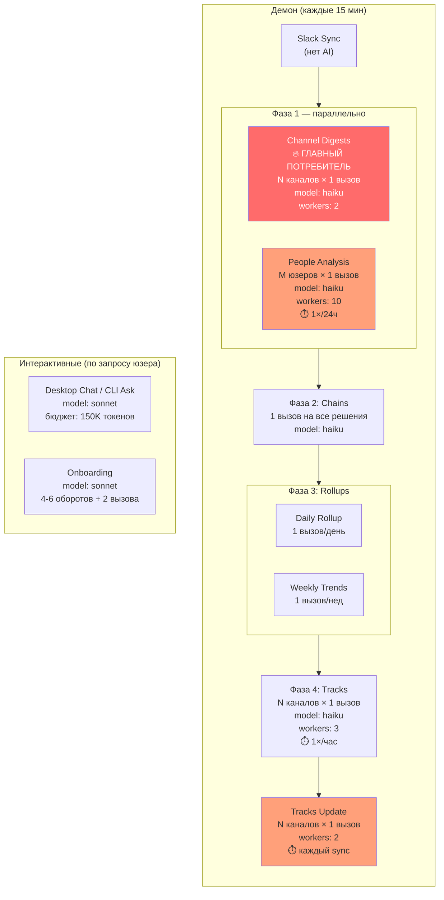
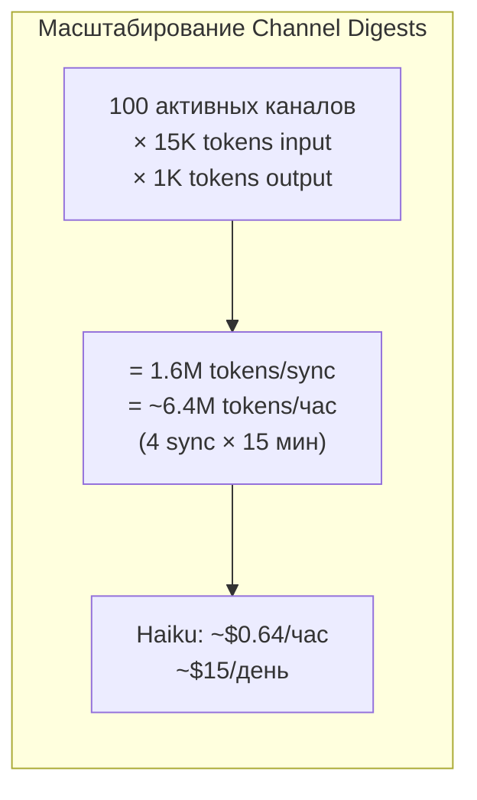
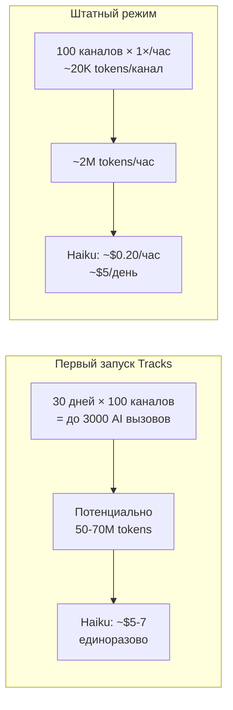
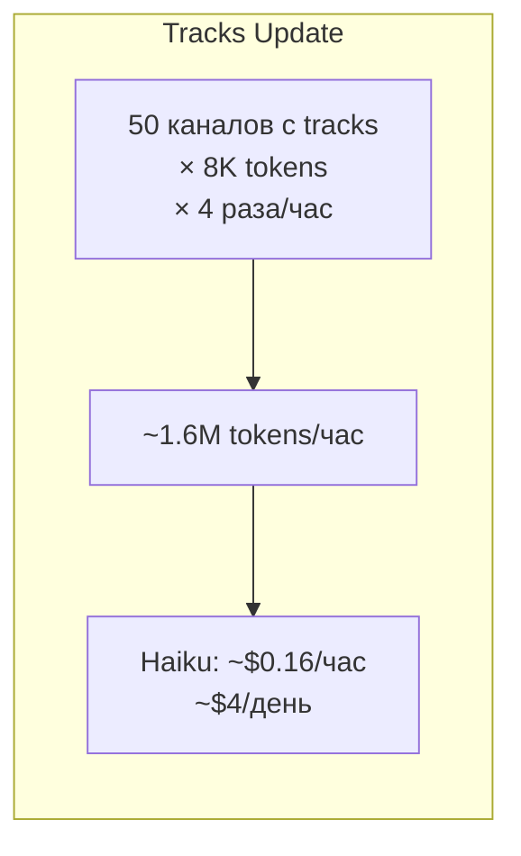
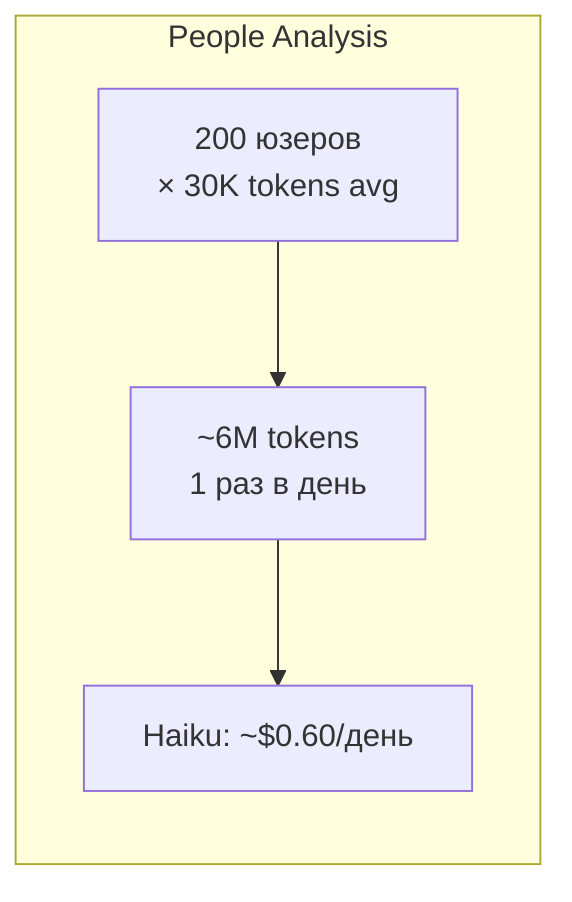
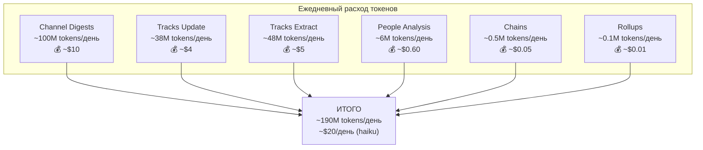
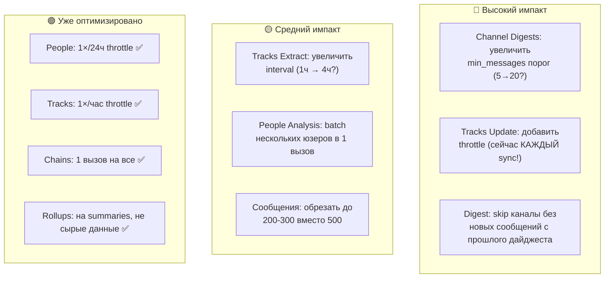

# LLM: расход токенов и точки вызова

## Сводка: все AI-вызовы системы

---

## Детальная разбивка по пайплайнам

### 1. Channel Digests — главный расход

**Частота:** каждый sync (по умолчанию каждые 15 мин)

**Количество вызовов = количество каналов** с ≥5 новых сообщений с последнего дайджеста.

**Что уходит в промпт (input):**

| Компонент | Размер |
|-----------|--------|
| Шаблон промпта + инструкции | ~1-2K tokens |
| Profile context пользователя | ~200-800 tokens |
| Сообщения канала (макс 500 шт) | **~5K-15K tokens** |
| Language / role instructions | ~100-200 tokens |
| **Итого на 1 канал** | **~6K-18K tokens input** |

**Output:** JSON (summary, topics, decisions, action_items, key_messages) — ~500-2K tokens.

**Лимиты и пороги:**
- `DefaultDigestMinMsgs = 5` — канал пропускается если < 5 сообщений
- `DefaultTimeRangeLimit = 500` — макс сообщений на канал
- `DefaultDigestWorkers = 2` — параллельные вызовы Claude

---

### 2. Tracks Extract — второй по расходу

**Частота:** throttled, **1 раз в час** (DefaultTracksInterval)

**Количество вызовов = количество каналов** с сообщениями в окне.

**Что уходит в промпт:**

| Компонент | Размер |
|-----------|--------|
| Шаблон промпта | ~2-3K tokens |
| Сообщения канала | **~5K-15K tokens** |
| Существующие tracks (дедупликация) | ~1-3K tokens |
| Chain context | ~0.5-2K tokens |
| Profile context | ~200-800 tokens |
| **Итого на 1 канал** | **~9K-24K tokens input** |

**Особенности:**
- Первый запуск: обрабатывает **30 дней** по-дневно (DefaultInitialHistDays) — огромный разовый расход
- `msgLimit = 50000` — абсолютный потолок сообщений за run
- `DefaultWorkers = 3` — параллельных вызовов
- Token cost делится поровну на кол-во извлечённых items

---

### 3. Tracks Update — частый, но лёгкий

**Частота:** **каждый sync** (каждые 15 мин) — без throttle!

**Количество вызовов:** по 1 на канал с активными tracks.

**Что уходит в промпт:**

| Компонент | Размер |
|-----------|--------|
| Список active tracks | ~1-3K tokens |
| Новые сообщения (макс 200) | ~2-5K tokens |
| Thread replies | ~1-3K tokens |
| **Итого на 1 канал** | **~4K-11K tokens** |

**Workers:** 2 параллельных.

---

### 4. People Analysis — редкий, но тяжёлый

**Частота:** **1 раз в 24 часа** (жёсткий throttle, персистируется на диск).

**Количество вызовов = количество юзеров** с ≥3 сообщениями за 7 дней.

**Что уходит в промпт:**

| Компонент | Размер |
|-----------|--------|
| Шаблон промпта | ~1-2K tokens |
| Статистика юзера (SQL) | ~500-1K tokens |
| Сообщения юзера (макс 5000!) | **~15K-50K tokens** |
| Profile context | ~200-800 tokens |
| **Итого на 1 юзера** | **~17K-54K tokens** |

**Workers:** 10 параллельных (!) + 1 period summary в конце.

---

### 5. Chains — лёгкий, 1 вызов

**Частота:** каждый sync, но только если есть unlinked decisions.

**Количество вызовов: 1** (все решения одним запросом) + N обновлений summaries.

| Компонент | Размер |
|-----------|--------|
| System prompt (chainsSystemPrompt) | ~1K tokens |
| Список active chains | ~1-5K tokens |
| Unlinked decisions (14 дней) | ~2-10K tokens |
| **Итого** | **~4K-16K tokens** |

Дёшево. ~$0.01-0.05/день.

---

### 6. Rollups — лёгкие, на основе дайджестов

**Daily:** 1 вызов/день. Input = summaries канальных дайджестов (~3-8K tokens).
**Weekly:** 1 вызов/неделю. Input = daily summaries (~5-15K tokens).

Дёшево. ~$0.01-0.03/день.

---

### 7. Interactive Chat (Desktop / CLI Ask)

**Частота:** по запросу юзера.

**Бюджет контекста: 150K tokens** (DefaultAIContextBudget).

| Tier | Бюджет | Содержимое |
|------|--------|-----------|
| 1. Workspace summary | ~1K | Статистика, watched каналы |
| 2. Priority context | 40% (60K) | Сообщения из watched сущностей |
| 3. Relevant context | 50% (75K) | FTS-результаты по запросу |
| 4. Broad context | 10% (15K) | Обзор активности |

**Model:** sonnet (по умолчанию) — **дороже haiku в ~5 раз**.

Multi-turn: sessionID переиспользуется, system prompt не отправляется повторно.

---

### 8. Onboarding — разовый

5 вызовов суммарно:
1. Health check: ~10 tokens
2. AI-интервью: 4-6 оборотов × ~2K tokens = ~12K
3. Profile extraction: ~3K tokens
4. Context generation: ~3K tokens

**Итого: ~20K tokens, один раз** при первом запуске.

---

## Итоговая таблица расхода (workspace ~100 каналов, ~200 юзеров)

| Пайплайн | Вызовов/день | Tokens input/вызов | Tokens/день | Модель | Доля расхода |
|----------|-------------|-------------------|-------------|--------|-------------|
| **Channel Digests** | ~400 (100 × 4/ч) | ~15K | ~100M | haiku | **52%** |
| **Tracks Extract** | ~2400 (100 × 24/ч) | ~20K | ~48M | haiku | **25%** |
| **Tracks Update** | ~9600 (50 × 4/ч × 48/д) | ~8K | ~38M | haiku | **20%** |
| **People Analysis** | ~200 (1×/день) | ~30K | ~6M | haiku | **3%** |
| **Chains** | ~96 | ~10K | ~0.5M | haiku | <1% |
| **Rollups** | ~2 | ~10K | ~0.1M | haiku | <1% |

---

## Точки оптимизации

### Ключевые проблемы:

1. **Tracks Update не throttled** — работает КАЖДЫЙ sync (каждые 15 мин). При 50 каналах с tracks = 50 AI вызовов × 4 раза/час = **200 вызовов/час** просто на проверку обновлений.

2. **Channel Digests переобрабатывают** — если в канале 6 сообщений за 15 мин, дайджест создаётся. Через 15 мин ещё 3 сообщения — ещё один дайджест. Можно копить до значимого объёма.

3. **DefaultTimeRangeLimit = 500** — слишком много для каналов с мелкими сообщениями. 200-300 хватило бы.

4. **Первый запуск Tracks = 30 дней** — огромный spike. Можно ограничить до 7 дней.
